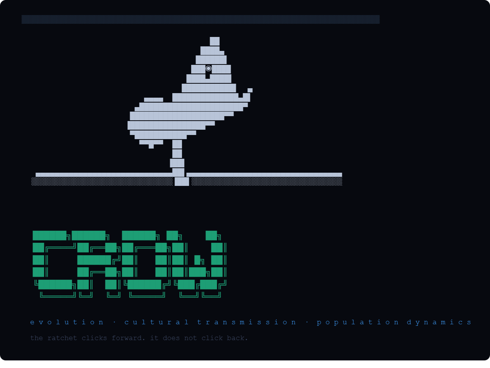

# Crow Learning Simulator Applied to Multi Agent Systems and Cyber Security

## The Science of Crows

### Why Crows?

Crows, yes Crows (Birds) are, outside of humans, the most sophisticated tool manufacturers on Earth. They fabricate hooks from twigs, cut stepped tools from pandanus leaves and  crucially — pass these techniques across generations with enough fidelity that geographically distinct populations have developed distinct regional tool traditions that persist for decades. This is the hallmark of cumulative technological culture: each generation inherits the best techniques of the last and, occasionally, improves on them.

What makes crows scientifically extraordinary is not just the tools themselves but the *transmission mechanism*. Crows do not appear to imitate motor actions directly. Research suggests they form **mental templates** — internal representations of a successful tool design and then reproduce those templates in new material. This is analogous to how a musician learns a melody: not by copying finger movements but by internalising the sound and then reconstructing it. The crow encodes *what success looks like*, not *how success was achieved*.

Three properties define their cumulative cultural evolution:

1. **Diversification** — multiple distinct tool designs exist across the population
2. **Cumulative change** — designs improve over time, each iteration building on prior discoveries
3. **High-fidelity transmission** — successful designs are reproduced accurately enough that improvements accumulate rather than drift away

The mechanism that enables this is called the **ratchet effect**: each successful innovation is locked in by transmission, so the population never slides back to a lower capability baseline. The ratchet clicks forward; it does not click back.

Social learning in crows is also selective. Juveniles take over a year to reach adult proficiency, spending that time observing parents, interacting with their tools as artefacts, and practicing. The learning is not passive broadcast — it is active, scaffolded, and mediated by proximity to successful practitioners.

### The Shared Artifact as Knowledge Carrier

Most relevant to this simulation: crows' tool designs are transmitted not only through observation of other crows but through interaction with the physical tools themselves. A juvenile who finds and handles an adult's pandanus tool learns something about the design even without watching it being made. The artefact carries information forward in time independently of any individual crow.

This is the biological model for this simulation's **shared state** — a persistent record in Redis that any agent can read, updated by each round's performance data. Like the pandanus leaf, it carries technique information across time and across individuals.

---

## The Simulation

### Core Theory

My prototype implements a computational analogue of New Caledonian crow cultural evolution applied to AI reasoning agents. The central question it attempts to answer is:

> **When multiple AI agents attempt the same task using different reasoning strategies, and can observe which strategies are performing well, does a selection-and-transmission dynamic emerge that improves population-level performance over successive rounds?**

Each agent in the population is assigned a **reasoning technique** — a system prompt that shapes how it approaches a problem. Techniques are analogous to tool designs: chain-of-thought is a structured stepped tool, direct inference is a simple hook, self-verify is a drafting-and-revision process. The agent does not choose its technique freely; it inherits it from the population's current state, just as a juvenile crow inherits its regional tool tradition.

Each round, all agents attempt the same subtask. Their responses are evaluated by a judge model using G-Eval — a chain-of-thought scoring approach where the evaluator reasons through each dimension before assigning a score. The judge is a different model from the agents, reducing self-preference bias. Ground-truth heuristics provide an independent signal on verifiable dimensions.

After scoring, a fitness update propagates: each technique's fitness score is updated via exponential moving average, weighting the new round's performance against accumulated history. Agents using low-fitness techniques observe what high-fitness agents produced, and with some probability adopt the winning technique. Bottom-performing agents are pruned from the population based on the actual score distribution.

This is the ratchet: successful techniques spread, unsuccessful ones lose agents, and the population's shared fitness record carries forward what worked.


### Techniques

| Name | Label | What it actually does |
|---|---|---|
| Hook tool | Chain-of-thought | Numbered reasoning steps before conclusion |
| Drop & retrieve | Web search + retrieval | Real web_search tool call — actual retrieval |
| Step-back probe | Step-back reasoning | First-principles reframing before answering |
| Direct strike | Direct inference | Immediate answer, no scaffolding |
| Verify-then-act | Self-verify loop | DRAFT / CRITIQUE / FINAL revision cycle |
| Code-exec grip | Code + execution | Writes Python, runs it, uses stdout in answer |

Hook tool — crows literally bend twigs into hooks to extract grubs from holes. The chain-of-thought technique hooks into a problem step by step, pulling reasoning out sequentially.

Drop & retrieve — crows drop objects into water or holes to retrieve food that was out of reach. The web search technique drops a query into the internet and retrieves something it couldn't have reached from memory alone.

Step-back probe — crows use probing tools by stepping back from the hole first to assess depth and angle before inserting. The step-back technique zooms out to first principles before engaging with the problem directly.

Direct strike — crows sometimes just strike at prey or food directly with their beak, no tool needed. The direct inference technique does the same — no scaffolding, just answer.

Verify-then-act — crows test a tool's fit before committing to using it, adjusting grip and angle. The self-verify loop drafts, tests its own output critically, then revises before committing.

Code-exec grip — crows grip tools at precise angles calibrated to the task. The code technique grips the problem computationally — writes structured code, executes it, uses the result as the answer rather than estimating.

---

## Practical Applications

### Cybersecurity: Red Team Simulation

The most direct application in security is **adversarial technique evolution**. Replace reasoning strategies with attack techniques:

- **Technique 0**: Structured kill-chain planning
- **Technique 1**: OSINT-grounded social engineering with live retrieval
- **Technique 2**: First-principles privilege escalation reasoning
- **Technique 3**: Direct exploit execution
- **Technique 4**: Attempt → detect evasion → revise approach
- **Technique 5**: Formal vulnerability enumeration

Each agent attempts to breach a simulated environment. The judge is replaced by an objective scorer: did the technique achieve code execution? Did it avoid detection? Did it exfiltrate data? These are binary, verifiable outcomes — exactly the ground truth the current prototype lacks for open-ended tasks.

The fitness dynamics reveal which attack techniques are most effective against your specific environment, which adapt fastest when defences change, and which fail to generalise. Run this across 1,000 agents over 100 rounds and you have a systematic adversarial stress test that discovers technique convergence — the attack a red team would eventually find — without requiring a human to enumerate every variant manually.

**Zero-day discovery**: frame the task as "find an input that causes unexpected behaviour in this function." Agents with code-execution capability actually run their attempts. Ground truth is whether execution produces an anomalous exit code or memory state. The population evolves toward effective fuzzing strategies organically.

### Threat Intelligence: Environmental Simulation

Your environment changes — new software is deployed, firewall rules are updated, users change behaviour. An agent population can be given real-time environmental context via the web search technique and asked to reason about which attack paths are viable given current conditions. The population's convergence tells you which threat vectors the current environment is most exposed to, informed by live threat intelligence rather than static models.

This models how actual adversaries operate: they adapt their techniques to the specific target environment, sharing successful approaches within their team. The simulation models that adaptive dynamic.

### Autonomous Systems: Evasion and Adaptation

For robotics and autonomous vehicles, replace reasoning techniques with motion planning strategies. The shared state carries which strategies successfully evaded a threat across previous encounters. Agents adapt in real time as the threat changes. The fitness function is objective — did the vehicle reach the goal state without detection or collision?

This maps directly to swarm robotics: a population of drones learning collectively which evasion strategies work against a particular adversary. The crow ratchet ensures that once an effective evasion technique is discovered it propagates through the population rather than dying with the individual agent that found it.

### Threat Modelling at Scale

The simulation's most valuable property for security practitioners is that it **externalises the search**. Instead of a security architect manually enumerating threat scenarios, a population of agents explores the space of possible approaches in parallel, with fitness selection identifying which scenarios are most viable. Run the same simulation against different environment configurations and compare which threat techniques converge in each. That comparison is your threat model.

---

## The Mathematics

### Exponential Moving Average (Fitness Update)

```
new_fitness = old_fitness × (1 - α) + round_score × α
```

Where α = 0.30 (`EMA_ALPHA`). Prevents a single round from dominating the fitness signal. Maps loosely to the selection pressure vs genetic drift tradeoff in Wright-Fisher population genetics — higher α means faster adaptation but more noise sensitivity.

### Composite Scoring

For verifiable tasks:
```
composite = 0.60 × judge_score + 0.40 × ground_truth_score
```

For open tasks:
```
composite = judge_score + speed_bonus
```

Speed bonus = max(0, (60 - elapsed_seconds) / 60 × 0.05), only applied when judge_score > 0.60.

Judge score is a weighted sum across five G-Eval dimensions:
```
judge_score = correctness    × 0.30
            + completeness   × 0.20
            + clarity        × 0.15
            + insight        × 0.25
            + actionability  × 0.10
```

### Pairwise Blend

```
final = absolute_score × (1 - w) + pairwise_rate × w
```

Where w = 0.35 (`PAIRWISE_WEIGHT`). Pairwise win rates are derived from up to 6 head-to-head comparisons per round, sampled randomly from all possible agent pairs.

### Percentile-Based Pruning

```
threshold = sorted_scores[floor(n × PRUNE_PERCENTILE)]
```

Agents in the bottom third of the ranking whose score falls below this threshold are candidates for pruning, subject to a minimum survivor count of 4. Adapts to actual score distribution rather than a fixed linear ramp.

### Convergence Detection

```
convergence = max(technique_count.values()) / len(alive_agents)
```

Early stopping triggers when convergence exceeds `CONVERGENCE_THRESHOLD` (0.80) for `CONVERGENCE_PATIENCE` (2) consecutive rounds.

---

## What the Frameworks Get Right

**G-Eval (Liu et al., 2023)** — chain-of-thought in the evaluator before scoring reduces variance significantly compared to direct scoring. The judge reasons through each dimension before assigning numbers, making it less susceptible to surface-level anchoring.

**Pairwise comparison (Alpaca Eval)** — relative judgements are more reliable than absolute scores for both humans and LLMs. The pairwise blend partially corrects for verbosity bias.

**Heterogeneous judge model** — using DeepSeek-R1 (trained with outcome-based RL rather than human preference RLHF) as the judge reduces self-preference bias. Claude judging Claude outputs systematically favours Claude's own stylistic tendencies.

**Ground truth injection** — for verifiable subtasks, heuristic functions score the response independently of the judge. This is a limited but honest signal that does not rely on the judge's opinion.

**Redis-backed shared state** — fitness history persists across restarts, enabling multi-run comparison via `/api/compare`.

**Real tool use** — Drop & retrieve uses Anthropic's native web search tool performing actual retrieval. Code-exec extracts and runs Python in a sandboxed subprocess with stdout injected back into the scored response.

---

## Current Limitations

### Scoring

**The judge is opinionated on open tasks.** "Insight" and "correctness" on open-ended questions are the judge's aesthetic preferences, not ground truth. A confident wrong answer can outscore a hedged correct one.

**Self-verify has a known ceiling.** The same model critiques its own output, sharing the same blind spots in both draft and critique passes.

**Convergence may reflect pruning artefacts.** If two agents of one technique are pruned early, the surviving technique looks dominant even if its fitness advantage is marginal.

### Biological Fidelity

**Agents have no memory between rounds.** Real crows take a year to develop proficiency. Each agent starts fresh each round — no learning within an agent's lifetime, only selection across the population.

**Technique adoption is label reassignment.** When an agent "copies" a technique, its system prompt is silently replaced. It does not read the winning response, extract what made it successful, and adapt its approach.

**The shared state is passive.** Agents receive a formatted string summarising fitness scores and a snippet from the last winner. Real crow juveniles interact with physical artefacts and practice over extended time. The information transmission here is thin.

---

## How More Resources Would Change This

### More API Budget / Higher Rate Limits

Scale to 50 agents and 50 rounds. Evolutionary dynamics only become statistically meaningful at larger population sizes — with 10 agents, one unlucky round can eliminate a technique before it has been fairly tested. Run the same topic 20 times and compute variance in which technique dominates — that variance measures whether the fitness signal is real or noise.

### GPU Clusters / Cloud Inference (AWS, RunPod, Lambda Labs)

Run heterogeneous model populations: some agents on Sonnet, some on a fine-tuned domain specialist, some on a local 70B model. Currently technique and model are confounded — you cannot tell if chain-of-thought wins because it is a better strategy or because it elicits better behaviour from Sonnet specifically. A mixed population deconfounds this.

A GPU cluster also enables true parallel local inference via vLLM — eliminating rate limits entirely and allowing 100+ agent populations at realistic speeds.

### Agent Memory

Implement a vector store per agent containing its previous responses, judge feedback, and self-assessments. Before each round the agent retrieves relevant prior experience. This is the mental template matching that crow research identifies as the probable transmission mechanism — the agent encodes what success looks like and reconstructs it in new material.

### Better Mathematical Grounding

- Replace arbitrary EMA α with a parameter derived from the population's score variance, following Wright-Fisher theory
- Implement pass@k consistency scoring across multiple runs to distinguish stable convergence from noise
- Replace linear pruning with tournament selection — the standard evolutionary computation approach with theoretical backing from population genetics
- Add a null model: run the same simulation with random technique assignment and compare convergence speed, testing whether selection pressure adds information or random drift explains the observed dynamics

### Verifiable Environments

Replace open-ended prose tasks with simulation environments: a network topology agents attempt to breach, a physics engine that validates robot arm trajectories, a code interpreter that runs and tests generated functions. Ground truth becomes binary and unambiguous. The judge's opinion becomes a secondary signal. This is where the cybersecurity applications become research-grade rather than illustrative.

---

## Observed Phenomena from Live Runs

These observations emerged from actual simulation runs during development and are documented here because they are scientifically interesting, not just engineering problems.

### Inference Latency as Involuntary Isolation

When the Anthropic API rate limiter hit all 10 agents simultaneously, something unexpected happened: **the population regressed from convergence**. Rounds that had been producing meaningful fitness differentiation collapsed to flat 0.50 scores across all agents. Techniques that had been pulling ahead lost their advantage.

The cause was that agents were timing out, backing off, and retrying at different intervals — meaning agents within the same round were working from different temporal snapshots of the shared state. Some agents read round N's fitness data, some effectively had no judge feedback at all. The population lost its ability to learn from collective performance.

This maps directly to the **Tasmanian Effect** in human cultural evolution. When Tasmania was cut off from mainland Australia roughly 10,000 years ago by rising sea levels, the isolated population of around 4,000 people progressively lost sophisticated tools they had previously possessed — bone tools, fishing equipment, cold-weather clothing. Isolation from the larger population's knowledge network caused capability regression, not stagnation. The tools didn't just fail to improve; they disappeared.

The mechanism is the same in both cases: without reliable access to the population's accumulated knowledge, individuals revert to locally-derived solutions. In the crow simulation, rate-limited agents fell back on their assigned techniques without the corrective signal of observing what was working for others. Techniques that should have been pruned survived because the fitness signal was corrupted. Convergence reversed.

This is not just an engineering failure — it is a meaningful observation about the conditions required for cultural transmission to function. **The shared state only works as a knowledge carrier if agents can reliably read from it with current data.** Asynchronous access to stale fitness information is worse than no shared state at all, because it produces misleading signals rather than absent ones.

### The Isolation Dial as an Experimental Variable

Building on this observation, the `INFERENCE_JITTER` parameter was added as a deliberate experimental control. By adding random delays (0–30 seconds) before each agent's inference call, you can simulate varying degrees of information isolation within a single run:

- **Jitter = 0**: Fully synchronous — all agents read from the same fitness snapshot, maximum transmission fidelity
- **Jitter = 15s**: Partial isolation — agents are working from fitness data that is 0–15 seconds old, some information loss
- **Jitter = 30s**: High isolation — agents effectively act on different rounds' data, approximating the Tasmanian condition

Running the same task at jitter=0 vs jitter=30 and comparing convergence speed and dominant technique stability is a direct computational test of the Tasmanian hypothesis: does information isolation slow convergence, and does it change *which* technique wins?

The prediction, grounded in the biological literature, is that high jitter should produce slower convergence, higher variance in which technique dominates across runs, and occasional regression events where a previously dominant technique loses ground as agents revert to locally-derived solutions.

### Population Size and Convergence Speed

A consistent observation across runs: **larger populations converge faster**, and the relationship is nonlinear. With 3 agents, convergence rarely stabilised — the population was too small for the fitness signal to be statistically meaningful, and pruning events (losing one agent) represented a 33% population change. With 6 agents, convergence was observable but erratic. With 10 agents, the fitness landscape differentiated more reliably by round 4–5.

This matches what population genetics theory predicts. In a small population, genetic drift — random variation — dominates over selection. The signal-to-noise ratio of selection is proportional to population size. Below a critical threshold, random events (a rate limit timeout, an unlucky subtask, a judge error) overwhelm the fitness signal and the population wanders rather than converges.

The practical implication for the cybersecurity applications is significant: **you need a large enough agent population for the evolutionary dynamics to produce meaningful signal**. A red team simulation with 5 agents is closer to random search than evolutionary optimisation. At 50 agents, technique fitness becomes a statistically robust measurement. At 500 agents, you can detect fine-grained technique variants within the same broad strategy.

### Token Budget and Convergence Quality

Agents given more tokens per response (800–1000) produced responses that differentiated more clearly between techniques. Chain-of-thought agents visibly numbered their steps; self-verify agents produced distinct DRAFT/CRITIQUE/FINAL sections; step-back agents wrote explicit first-principles preambles. The judge could reliably distinguish between them and assign differentiated scores.

At 200–300 tokens, all techniques tended toward similar outputs — short, direct answers that the judge scored similarly regardless of technique. The fitness landscape flattened. Convergence happened, but toward whichever technique happened to score highest on the first round rather than through genuine selection pressure.

This suggests a **minimum viable token budget** for technique differentiation to be meaningful. The threshold appears to be around 600-1000 tokens for the tasks tested — enough for a technique's structural properties to be expressed but not so much that verbosity alone dominates the score.

The implication for scaling: increasing tokens per agent does not just improve response quality, it improves the *discriminability* of the fitness signal. A simulation with 10 agents at 800 tokens will converge more reliably than one with 20 agents at 200 tokens, because the fitness differences between techniques are large enough for the judge to detect.

### Agents Choosing Alternative Paths Under Stress

When agents could not reliably access tool capabilities — web search timeouts, code execution failures — they did not simply produce empty responses. They adapted, often producing responses that looked superficially like other techniques. A Drop & retrieve agent that could not search fell back on recalled training knowledge and structured it like a chain-of-thought response. A code-exec agent whose code failed produced prose estimates instead.

This created a measurement artefact: the judge would score these fallback responses favourably because the output quality was acceptable, but the fitness update was attributed to the wrong technique. Drop & retrieve would gain fitness for a response that was actually direct inference under the hood.

This is analogous to a crow that cannot find pandanus leaves manufacturing a functionally equivalent tool from a different material — the tool works, but the technique count in the population is now misleading. The biological literature notes this as a confound in social learning studies: what looks like technique transmission may be independent invention under similar environmental pressures.

In the simulation, this means **technique fitness scores are partially confounded with tool availability**. A technique that relies on external tools will underperform its true capability when those tools are unreliable, and the fitness signal will misattribute the fallback behaviour to the technique label rather than the environmental constraint. Disentangling this requires either guaranteed tool reliability or explicit tracking of whether tools were actually used in each response.

---

## Getting Started

### Prerequisites

- Docker Desktop with GPU access
- Ollama running with models pulled:
  ```bash
  docker exec kloc-ollama ollama pull deepseek-r1:14b
  docker exec kloc-ollama ollama pull qwen2.5-coder:7b
  ```
- Anthropic API key (or set `AGENT_BACKEND=ollama`)

### Warm the Judge Before Each Session

```bash
docker exec kloc-ollama ollama run deepseek-r1:14b ""
docker exec kloc-ollama ollama ps   # confirm 100% GPU
```

### Configuration (.env)

```env
ANTHROPIC_API_KEY=sk-ant-...

# Agent backend
AGENT_BACKEND=anthropic
SIM_MODEL=claude-sonnet-4-20250514
AGENT_OLLAMA_URL=http://172.17.0.2:11434

# Judge (local R1 on your GPU)
JUDGE_BACKEND=ollama
JUDGE_MODEL=deepseek-r1:14b
OLLAMA_URL=http://172.17.0.2:11434

# Population
N_AGENTS=10
N_ROUNDS=10
MAX_TOKENS=400
AGENT_STAGGER=3.0

# Task
TASK_TOPIC=A category 4 hurricane is 48 hours out and the city's evacuation routes are already gridlocked. What are the three most critical decisions the emergency manager must make in the next two hours, and why?

# Scoring
EMA_ALPHA=0.30
PAIRWISE_WEIGHT=0.35
PRUNE_PERCENTILE=0.25
CONVERGENCE_THRESHOLD=0.80
CONVERGENCE_PATIENCE=2
INFERENCE_JITTER=0.0
```

### Start

```bash
docker compose -f docker-compose.dev.yml down
docker compose -f docker-compose.dev.yml up --build
```

Open **http://localhost:3000**

### API Endpoints

| Endpoint | Description |
|---|---|
| `GET /health` | Agent model, judge model, current round |
| `GET /api/logs` | Full event log |
| `GET /api/state` | Current population state |
| `GET /api/results` | All round history |
| `GET /api/compare` | Cross-run convergence comparison |
| `GET /api/runs` | Redis-backed run history |

---

*Built as a thought experiment in computational cultural evolution.*
*The crow ratchet clicks forward. It does not click back.*
